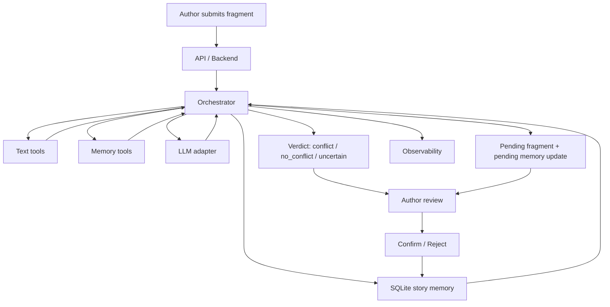

# Story Consistency Agent

## Что это

`Story Consistency Agent` — агентная система для писателя и сценариста, которая помогает поддерживать консистентность мира истории во время работы над текстом.

Система принимает новый фрагмент, извлекает из него структурированные элементы истории, подтягивает релевантную память мира и возвращает один из трёх исходов:
- `conflict`
- `no_conflict`
- `uncertain`

При этом новые сцены и новые записи памяти не попадают в подтверждённую историю автоматически. Сначала они сохраняются как `pending update`, и только после явного подтверждения переходят в canonical story memory.

## Что хранит память истории

Система строит и поддерживает несколько слоёв памяти:
- персонажи
- объекты
- факты
- события
- связи между сущностями
- исходные текстовые фрагменты и chunks
- pending updates

Это позволяет анализировать новую сцену не как isolated prompt, а как продолжение уже существующего мира истории.

## Основной поток

1. Автор создаёт историю и отправляет исходный текст.
2. Система извлекает кандидатов на персонажей, объекты, события, факты и связи.
3. Агент подтягивает релевантную память и соседние куски текста, если в сцене есть ссылки вроде `он`, `она`, `они`.
4. Агент оценивает сцену и возвращает `conflict`, `no_conflict` или `uncertain`.
5. Если сцена не даёт явного конфликта, система stage'ит pending fragment и pending memory update.
6. Только `confirm` переводит pending-данные в подтверждённую память истории.

## Архитектура



Подробности зафиксированы в:
- [system-design.md](/c:/Users/recroot/Documents/katya/ITMO_hub/4%20semestr/agentic_track/docs/system-design.md)
- [product-proposal.md](/c:/Users/recroot/Documents/katya/ITMO_hub/4%20semestr/agentic_track/docs/product-proposal.md)
- [governance.md](/c:/Users/recroot/Documents/katya/ITMO_hub/4%20semestr/agentic_track/docs/governance.md)
- [evaluation-summary.md](/c:/Users/recroot/Documents/katya/ITMO_hub/4%20semestr/agentic_track/docs/evaluation-summary.md)
- `docs/specs/`
- `docs/diagrams/`

## Текущие модули

- `app/storage/` — SQLite schema, миграции, repositories, data service
- `app/tools_v2/` — text tools, memory tools, write-proposal tools без LLM
- `app/agent_v2/` — новый orchestrator и LLM adapter
- `app/api/` — HTTP endpoints
- `app/frontend/` — базовый web UI
- `app/observability/` — traces и summary

## Важные принципы

- `read` и `write` path разделены
- анализ сцены не вносит изменения в подтверждённую память напрямую
- даже исходный текст сначала проходит через pending-flow
- подтверждение и отклонение обновлений отделены от самого анализа
- контекст для модели собирается из релевантной памяти и chunk windows, а не из всего текста сразу

## API

Системные endpoints:
- `GET /`
- `GET /health`
- `GET /stories`
- `GET /stories/{story_id}`
- `GET /observability/summary`
- `GET /observability/traces`

Рабочий поток автора:
- `POST /stories/ingest`
- `POST /stories/{story_id}/analyze`
- `POST /stories/{story_id}/pending-updates/{update_id}/confirm`
- `POST /stories/{story_id}/pending-updates/{update_id}/reject`

## Базовый web UI

Интерфейс позволяет:
- создать историю из исходного текста
- отправить новый фрагмент на проверку
- увидеть verdict и объяснение агента
- подтвердить или отклонить pending updates
- посмотреть observability summary и recent traces

## Локальный запуск

```bash
uvicorn app.main:app --reload
```

Проверка сервиса:

```bash
curl http://127.0.0.1:8000/health
```

После запуска открыть:

```text
http://127.0.0.1:8000/
```

## Docker

```bash
docker compose up -d --build
```

Наружу публикуется только порт:
- `8000:8000`

## Тесты

Новый memory-centric контур проверяется тестами:

```bash
python -m unittest -v tests.test_storage tests.test_tools_v2 tests.test_agent_v2 tests.test_api
```

Если локального `python` нет, можно прогонять через временный контейнер:

```bash
docker run --rm -v "${PWD}:/workspace" -w /workspace python:3.12 sh -lc "python -m pip install -e . && python -m unittest -v tests.test_storage tests.test_tools_v2 tests.test_agent_v2 tests.test_api"
```

Краткая выжимка по evaluation:
- покрыты extraction, retrieval, verdict, pending-confirm-reject и API flow;
- regression suite проверяет ключевые типы конфликтов: `character`, `fact`, `timeline`, `object`, а также `uncertain`;
- актуальный полный прогон: `31 / 31 tests passed`;
- отдельный акцент сделан на отсутствие скрытых записей в подтверждённую память и на отсутствие утечки `pending` / `rejected` сцен в последующий анализ.

Кратко про ограничения:
- основная зона риска сейчас не в архитектуре, а в качестве малой модели на сложных русскоязычных сценах;
- наиболее чувствительные случаи: смешение `fact` и `event`, смешение фактов и описаний персонажа, а также нелинейные временные переходы и связанные состояния объектов.

## Scope

Система:
- не пишет книгу за автора
- не оценивает литературную ценность текста
- не подменяет профессионального редактора
- не делает скрытых записей в canonical story memory
- не требует от автора промпт-инжиниринга для базового сценария проверки сцены
