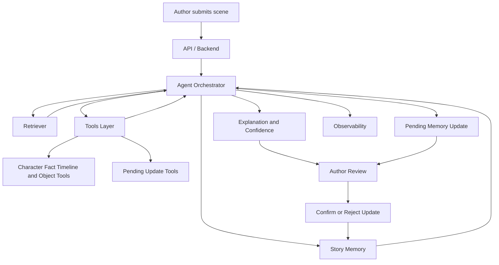

# Story Consistency Agent | AI writer assistant | StoryWorld Agent | Narrative Consistency Agent

## Что это за система

`Story Consistency Agent` — агентная система для писателя и сценариста, которая помогает поддерживать консистентность мира истории во время работы над текстом.

Система:
- загружает черновик рассказа;
- извлекает персонажей, факты, события и некоторые состояния объектов;
- поддерживает `story memory`;
- анализирует новые сцены и куски текста;
- сама выбирает полезные инструменты для проверки;
- находит `conflict`, `no_conflict` и `uncertain`;
- возвращает объяснение, `confidence`, `stop_reason` и `tool_traces`;
- создаёт `pending update`, но не меняет подтверждённую память без явного решения автора.

Это не просто `RAG` и не жёсткий workflow. В системе есть `orchestrator`, `tools`, retrieval, bounded agent execution, `story memory`, `pending -> confirm/reject` write path и слой observability.

## Для кого и какую боль решает

При работе над длинной историей автору приходится удерживать в голове:
- характеры персонажей;
- уже зафиксированные факты;
- отношения между героями;
- последовательность событий;
- состояние важных объектов.

Из-за этого появляются несостыковки. Например:
- герой был смелым, а через сцену вдруг ведёт себя трусливо без объяснения;
- персонаж живёт на острове, а потом внезапно оказывается местным жителем другого города;
- предмет потеряли, а в следующем фрагменте он уже снова у героя.

`Story Consistency Agent` снимает часть этой нагрузки и помогает проверять новые сцены с опорой на память истории, а не только на текущий текст.

## Что реализовано сейчас

Реализован минимальный, но рабочий PoC, который уже можно показывать на демо:
- ingest текста истории;
- chunking и retrieval по chunks и memory;
- извлечение `characters`, `facts`, `events` и части `object state`;
- анализ новой сцены через agent orchestrator;
- выбор tools через live LLM path или heuristic fallback;
- статусы `conflict`, `no_conflict`, `uncertain`;
- `pending update`, `confirm`, `reject`;
- request tracing, `tool_traces`, observability summary и recent traces;
- web UI без перезагрузки страницы;
- smoke tests, benchmark и live smoke.

## Что именно показывается на финальном демо

На финальном показе система демонстрирует полный end-to-end поток:
- загрузка рассказа;
- анализ нового фрагмента;
- возврат одного из исходов: `conflict`, `no_conflict`, `uncertain`;
- объяснение найденной проблемы;
- показ выбранных инструментов и `orchestrator_mode`;
- создание `pending update`;
- подтверждение или отклонение обновления памяти;
- observability summary, показывающую поведение агента.

Для показа подготовлен отдельный литературный demo-world:
- [demo-story.txt](/c:/Users/recroot/Documents/katya/ITMO_hub/4%20semestr/agentic_track/data/demo-story.txt)
- [demo-scenarios.json](/c:/Users/recroot/Documents/katya/ITMO_hub/4%20semestr/agentic_track/data/demo-scenarios.json)
- [demo-writing-session.json](/c:/Users/recroot/Documents/katya/ITMO_hub/4%20semestr/agentic_track/data/demo-writing-session.json)
- [demo-runbook.md](/c:/Users/recroot/Documents/katya/ITMO_hub/4%20semestr/agentic_track/docs/demo-runbook.md)
- [demo-requests.md](/c:/Users/recroot/Documents/katya/ITMO_hub/4%20semestr/agentic_track/docs/demo-requests.md)
- [demo-checklist.md](/c:/Users/recroot/Documents/katya/ITMO_hub/4%20semestr/agentic_track/docs/demo-checklist.md)

## Demo world

Для финального показа используется короткий оригинальный русский рассказ `Колокол без моря`.

В центре истории:
- Лев из Приморска;
- Павел с острова Маячный;
- старый журнал маяка;
- поездка к острову;
- бытовые и сюжетные детали, на которых можно проверять консистентность.

Этот мир специально сделан не как сухой тестовый набор фактов, а как короткий рассказ, который можно скармливать системе кусками, как будто автор реально пишет сцену за сценой.

## Что умеет ловить текущий PoC

Сейчас система лучше всего работает на таких классах несостыковок:
- `character` — противоречие характеру персонажа;
- `fact` — противоречие уже известным фактам;
- `timeline` — конфликт временных указаний;
- `object` — конфликт состояния объекта.

Пример object-state конфликта:
- герой потерял ключ;
- в следующем фрагменте он уже снова держит ключ;
- сцены, где ключ нашли, не было.

## Базовый web UI

У системы есть минимальный web UI без перезагрузки страницы.

Что можно делать из интерфейса:
- загрузить demo-story;
- загрузить writer session;
- создать историю;
- поочерёдно подставлять новые куски;
- отправлять сцену на анализ;
- подтверждать и отклонять pending updates;
- смотреть observability summary и recent traces.

Точка входа в UI:
- `GET /`

Статические файлы:
- `app/frontend/index.html`
- `app/frontend/styles.css`
- `app/frontend/app.js`

## Архитектура



Ключевые модули:
- `API / Backend` — HTTP endpoints и request handling;
- `Agent Orchestrator` — выбор tools, bounded execution, stop reasons;
- `Retriever` — narrative retrieval и memory retrieval;
- `Story Memory` — подтверждённые факты и pending updates;
- `Tools Layer` — read tools и write-proposal tools;
- `Observability` — traces и summary по агентному поведению.

Подробности зафиксированы в:
- [system-design.md](/c:/Users/recroot/Documents/katya/ITMO_hub/4%20semestr/agentic_track/docs/system-design.md)
- [governance.md](/c:/Users/recroot/Documents/katya/ITMO_hub/4%20semestr/agentic_track/docs/governance.md)
- `docs/specs/`
- `docs/diagrams/`

## Реализованные API endpoints

Системные:
- `GET /`
- `GET /health`
- `GET /stories`
- `POST /stories/ingest`
- `GET /stories/{story_id}`

Агентный контур:
- `POST /stories/{story_id}/analyze`
- `POST /stories/{story_id}/append-scene`

Управление памятью:
- `POST /stories/{story_id}/pending-updates/{update_id}/confirm`
- `POST /stories/{story_id}/pending-updates/{update_id}/reject`

Observability:
- `GET /observability/summary`
- `GET /observability/traces`

Demo data:
- `GET /demo/story`
- `GET /demo/writing-session`
- `GET /demo/scenarios`

## Что видно в ответе агента

`analyze_scene` возвращает:
- `status`
- `issue_type`
- `explanation`
- `confidence`
- `evidence_refs`
- `stop_reason`
- `orchestrator_mode`
- `agent_step_count`
- `tool_call_count`
- `tool_traces`
- `memory_update_proposal_id`

Это важно для защиты, потому что показывает не только итог, но и поведение агента.

## Guardrails и ограничения

В текущем PoC уже соблюдаются такие правила:
- write path отделён от read path;
- подтверждённая память не меняется без `confirm`;
- есть `reject` path для pending updates;
- live LLM path имеет heuristic fallback;
- orchestrator ограничен по шагам и числу tool calls;
- агент возвращает `uncertain`, если evidence недостаточно;
- observability хранит traces анализа и update actions.

## Что НЕ входит в scope

Система:
- не пишет книгу за автора;
- не оценивает литературную ценность текста;
- не заменяет профессионального редактора;
- не гарантирует объективную истинность художественных решений;
- не вносит изменения в подтверждённую память автоматически;
- не реализует полноценный редактор текста;
- не строит сложную graph memory в текущем PoC.

## Дальнейшая работа

Следующий естественный шаг после текущего PoC:
- вынести память мира в более явную graph memory;
- добавить слой наподобие `MEMO 0`, который выделяет персонажей, факты и состояния;
- хранить актуальность и устаревание фактов;
- улучшить object-state и causal consistency;
- расширить retrieval и нормализацию временных выражений.

Сейчас это сознательно оставлено как `future work`, чтобы основной demo оставался компактным и стабильным.

## Локальный запуск

После установки зависимостей:

```bash
uvicorn app.main:app --reload
```

Проверка сервиса:

```bash
curl http://127.0.0.1:8000/health
```

Ожидаемый ответ:

```json
{"status":"ok"}
```

После запуска можно открыть:

```text
http://127.0.0.1:8000/
```

## Тесты

Обычный smoke suite:

```bash
python -m unittest -v
```

Live LLM smoke:

```bash
python tests/live_smoke.py
```

Demo benchmark:

```bash
python tests/demo_eval.py
```

Если локального `python` нет, можно использовать контейнерный прогон:

```bash
docker run --rm -v "${PWD}:/workspace" -w /workspace python:3.12 sh -lc "python -m pip install -e . && python -m unittest -v && python tests/demo_eval.py"
```

## Структура репозитория

- `app/` — backend, orchestrator, tools, retrieval, memory, observability и frontend
- `tests/` — smoke tests, benchmark и live smoke
- `data/` — demo story, scenarios, writing session и runtime stories
- `docs/product-proposal.md` — Milestone 1 proposal
- `docs/governance.md` — risk register и protections
- `docs/system-design.md` — Milestone 2 system design
- `docs/specs/` — спецификации модулей
- `docs/diagrams/` — C4, workflow и data flow диаграммы
- `docs/demo-*` — материалы для финального demo

## Что проговаривать на защите

- почему это агент, а не fixed workflow;
- где находится `story memory`;
- какие tools выбирает orchestrator;
- как система показывает `uncertainty`;
- почему write path защищён через `pending -> confirm/reject`;
- какие guardrails и ограничения есть;
- как качество наблюдается через traces и summary;
- что graph memory и `MEMO 0` запланированы как следующий шаг, а не притянуты в текущий PoC ценой стабильности demo.
