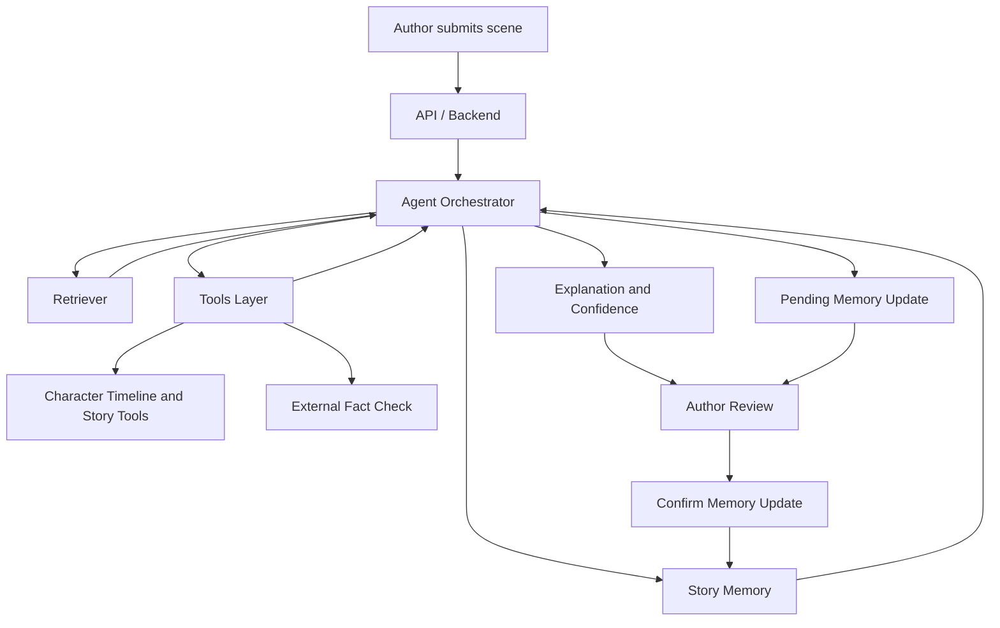

# Story Consistency Agent | AI writer assistant | StoryWorld Agent | Narrative Consistency Agent

## Что за задача, для кого и какая боль сейчас

`Story Consistency Agent` — агент-помощник для писателя и сценариста, который помогает поддерживать консистентность мира истории.

При работе над длинными текстами автору приходится удерживать в голове большое количество деталей: характеры персонажей, хронологию событий, отношения между героями, правила мира и уже зафиксированные факты. На практике это приводит к несостыковкам, ручной перепроверке сцен и росту когнитивной нагрузки во время редактирования.

Проект решает эту проблему за счёт агентной системы, которая:
- читает уже написанный текст;
- извлекает персонажей, события и факты;
- поддерживает структурированную память мира истории;
- анализирует новые сцены на предмет противоречий;
- объясняет найденные конфликты и даёт автору понятный вывод.

## Что именно сделает PoC на демо

На демо PoC сможет:
- загрузить уже написанный текст истории;
- извлечь персонажей, их свойства и ключевые события;
- сформировать и обновлять память мира истории;
- принять новый фрагмент текста и проанализировать его;
- самостоятельно выбрать нужные инструменты для проверки сцены, памяти, таймлайна и связанных фактов;
- обнаружить потенциальные конфликты в характерах, фактах и временной линии;
- показать объяснение найденной проблемы и уровень уверенности;
- ответить на вопрос автора по выделенному фрагменту с опорой на story memory.

PoC позиционируется именно как агентная система, потому что модель не идёт по жёстко заданному workflow, а принимает решения о выборе tools, порядке шагов, повторных проверках и моменте остановки анализа.

## Что НЕ делает PoC

Явный `out-of-scope` для Milestone 1 и PoC:
- система не пишет книгу за автора;
- не оценивает литературное качество или стиль;
- не заменяет профессионального редактора;
- не гарантирует объективную правильность художественных решений;
- не поддерживает сложную IDE-интеграцию или полноценный текстовый редактор;
- не выполняет автоматические изменения story memory без подтверждения пользователя.

## Структура Milestone 1

В репозитории для согласования проекта подготовлены:
- `README.md` — краткое описание задачи, PoC и ограничений;
- `docs/product-proposal.md` — продуктовое и техническое обоснование;
- `docs/governance.md` — риски, защиты и правила работы с данными.
- `docs/system-design.md` — архитектурные решения, workflow, state, tools и guardrails;
- `docs/diagrams/` — набор системных диаграмм для Milestone 2;
- `docs/specs/` — короткие технические спецификации по ключевым модулям.
- `docs/implementation-plan.md` — чеклист реализации MVP с checkpoint-ами.

## Простая архитектурная диаграмма



## MVP Backend

В репозитории есть минимальный backend-каркас для демо:
- `FastAPI` приложение в `app/`;
- ingestion истории и новых сцен;
- простое файловое хранилище story memory в `data/stories/`;
- bounded demo orchestrator;
- pending update / confirm flow;
- request logging middleware.

Основные endpoints:
- `GET /health`
- `GET /stories`
- `POST /stories/ingest`
- `GET /stories/{story_id}`
- `POST /stories/{story_id}/analyze`
- `POST /stories/{story_id}/pending-updates/{update_id}/confirm`

Локальный запуск после установки зависимостей:

```bash
uvicorn app.main:app --reload
```

Для демо можно использовать подготовленный пример истории:
- `data/demo-story.txt`
- `data/demo-scenarios.json`

Дополнительный сценарий показа:
- `docs/demo-script.md`
