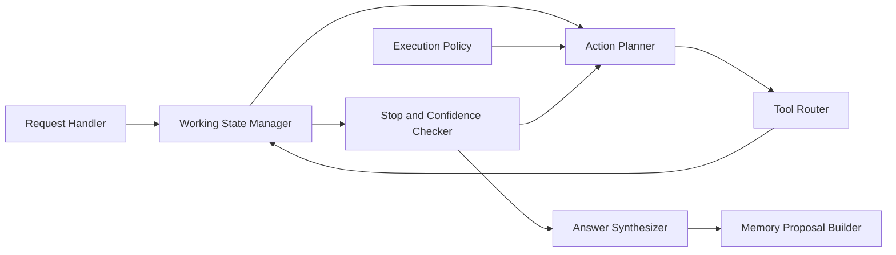

# C4 Component

Назначение диаграммы:
- объяснить внутреннее устройство агентного ядра;
- показать, что planner, state manager и stop checker разделены;
- подчеркнуть наличие отдельного memory proposal path.
