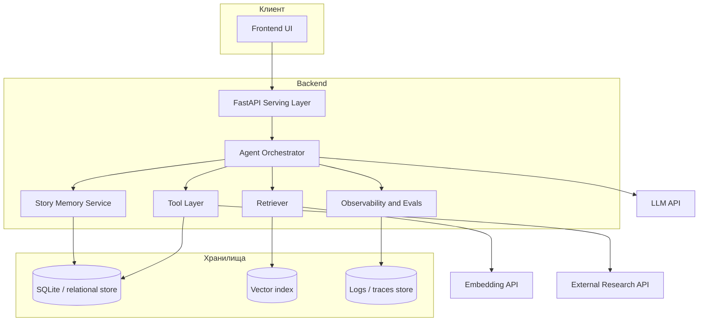

# C4 Container

```mermaid
flowchart TB
    subgraph client[Клиент]
        ui[Frontend UI]
    end

    subgraph backend[Backend]
        api[FastAPI Serving Layer]
        orch[Agent Orchestrator]
        tools[Tool Layer]
        retr[Retriever]
        mem[Story Memory Service]
        evals[Observability and Evals]
    end

    subgraph storage[Хранилища]
        sql[(SQLite / relational store)]
        vec[(Vector index)]
        logs[(Logs / traces store)]
    end

    llm[LLM API]
    embed[Embedding API]
    web[External Research API]

    ui --> api
    api --> orch
    orch --> tools
    orch --> retr
    orch --> mem
    orch --> evals
    retr --> vec
    retr --> embed
    mem --> sql
    tools --> sql
    tools --> web
    orch --> llm
    evals --> logs
```

Назначение диаграммы:
- показать контейнеры PoC-системы;
- выделить agent orchestrator как ядро;
- разделить structured memory, retrieval storage и observability.
