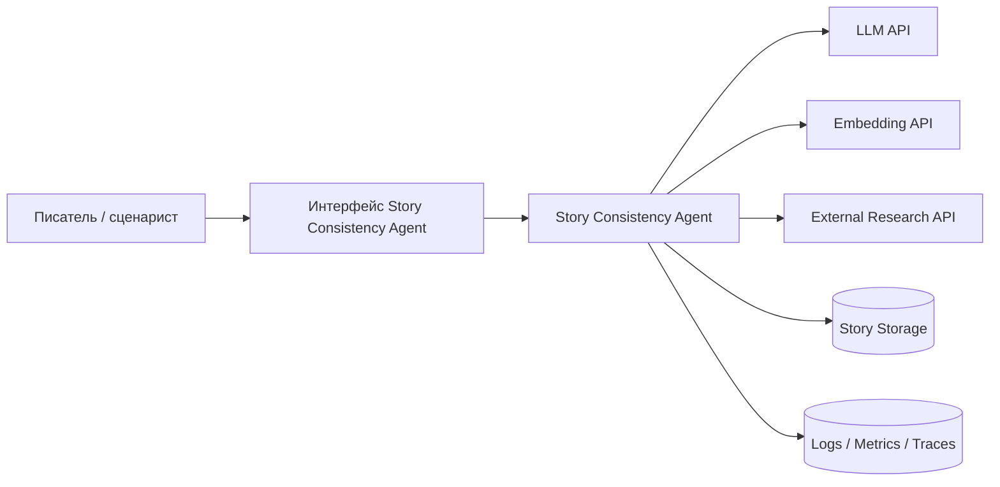

# C4 Context

Назначение диаграммы:
- показать границу системы;
- отделить внешние model providers от внутренних компонентов PoC;
- показать, что пользователь взаимодействует не с LLM напрямую, а с агентной системой.
