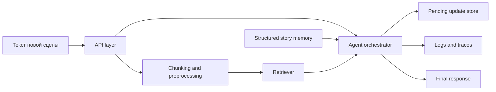

# Data Flow Diagram

Назначение диаграммы:
- показать, как входной текст превращается в retrieval evidence и итоговый ответ;
- отделить confirmed memory от pending updates;
- показать, какие данные логируются для observability и evals.
