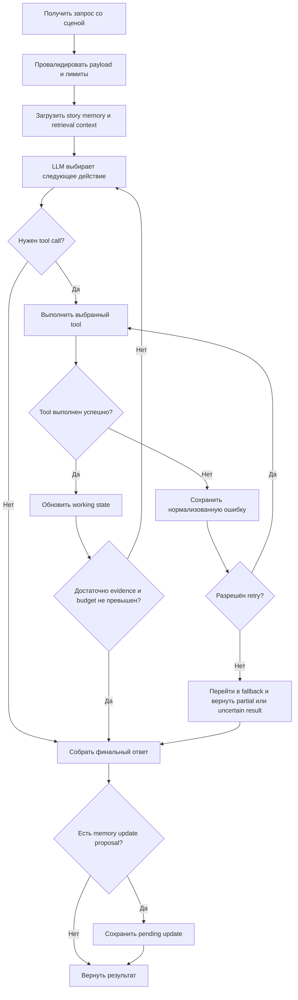

# Workflow Diagram

```mermaid
flowchart TD
    A[Получить запрос со сценой] --> B[Провалидировать payload и лимиты]
    B --> C[Загрузить story memory и retrieval context]
    C --> D[LLM выбирает следующее действие]

    D --> E{Нужен tool call?}
    E -->|Да| F[Выполнить выбранный tool]
    E -->|Нет| K[Собрать финальный ответ]

    F --> G{Tool выполнен успешно?}
    G -->|Да| H[Обновить working state]
    G -->|Нет| I[Сохранить нормализованную ошибку]

    H --> J{Достаточно evidence и budget не превышен?}
    J -->|Нет| D
    J -->|Да| K

    I --> L{Разрешён retry?}
    L -->|Да| F
    L -->|Нет| M[Перейти в fallback и вернуть partial или uncertain result]

    M --> K
    K --> N{Есть memory update proposal?}
    N -->|Нет| O[Вернуть результат]
    N -->|Да| P[Сохранить pending update]
    P --> O
```

Назначение диаграммы:
- показать основной agent loop;
- показать ветки ошибок и retry/fallback;
- отделить analysis flow от подтверждённой записи в память.
